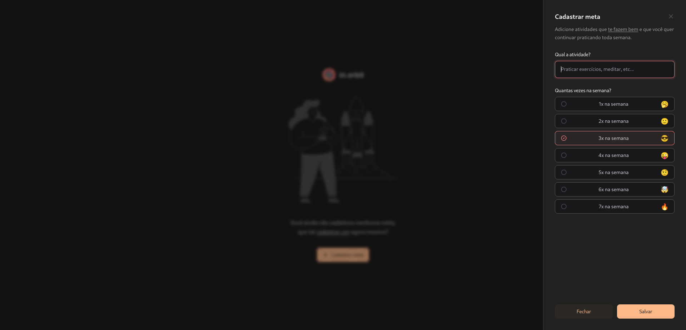
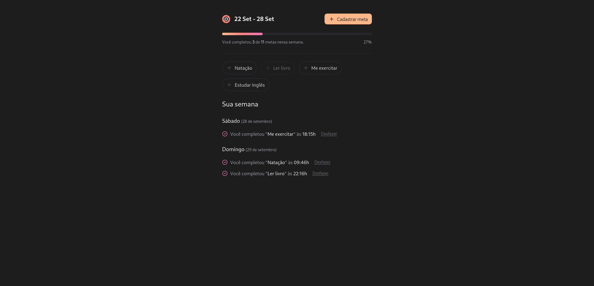

<h1 align="center" style="font-weight: bold;">my.orbit 🪐</h1>

<p align="center">
  <a href="#technologies">Technologies</a> • 
  <a href="#started">Getting Started</a> • 
  <a href="#routes">Routes</a> • 
  <a href="#colab">Collaborators</a>
</p>

<p align="center">
    <b>my.orbit is an application that serves as your personal companion in achieving your goals. With it, you can chart your own cosmic course, setting goals and monitoring each step towards success.</b>
</p>

<!-- <p align="center">
     <a href="PROJECT__URL">📱 Visit this Project</a>
</p> -->

<h2 id="layout">🎨 Layout</h2>

<p align="center">
    <!-- ../.github/example.png -->
    
    
</p>

<h2 id="technologies">💻 Technologies</h2>


<h2 id="started">🚀 Getting started</h2>


<h3>Prerequisites</h3>

- [NodeJS ^20.17.0](https://nodejs.org/pt)
- [Docker](https://www.docker.com/)
- [bitnami/postgresql](https://hub.docker.com/layers/bitnami/postgresql/13.16.0/images/sha256-1cdf3a76bfb709c761cea5dbbb162111f557031143505c718debdb4da0d6b4e4?context=explore)


<h3>Cloning</h3>

```bash
git clone https://github.com/MarlonVictor/myOrbit.git
```

<h3> Environment Variables</h2>

Use the `.env.example` as reference to create your configuration file

<h3>Only in the first entry of the project</h3>

```bash
cd server

npm install

docker compose up -d

npx drizzle-kit generate
npx drizzle-kit migrate

npm run seed
```

```bash
cd web

npm install
```

<h3>Starting</h3>

```bash
cd server

npm run dev
```

```bash
cd web

npm run dev
```

<div id="routes"></div>

## 📍 Application Routes

| route               | description                                          
|----------------------|-----------------------------------------------------
| <kbd>/</kbd>     | main page with all CTOs and list of goals


## 📍 API Endpoints

| route               | description                                          
|----------------------|-----------------------------------------------------
| <kbd>GET /pending-goals</kbd>     | brings list of all registered goals
| <kbd>GET /summary</kbd>     | List the goals completed on their respective days
| <kbd>POST /goals</kbd>     | create a new goal
| <kbd>POST /completions</kbd>     | mark the goal as completed on day
| <kbd>DELETE /completions/:id</kbd>     | unmark goal as completed on the day


<h2 id="colab">🤝 Collaborators</h2>

<table>
  <tr>
    <td align="center">
      <a href="https://github.com/MarlonVictor" target="_blank">
        <br>
        <sub>
          <b>Marlon Victor</b>
        </sub>
      </a>
    </td>
    <td align="center">
      <a href="https://github.com/diego3g" target="_blank">
        <br>
        <sub>
          <b>Diego Fernandes</b>
        </sub>
      </a>
    </td>
  </tr>
</table>

<h2 id="license">License 📃 </h2>

This project is under [MIT](./LICENSE) license